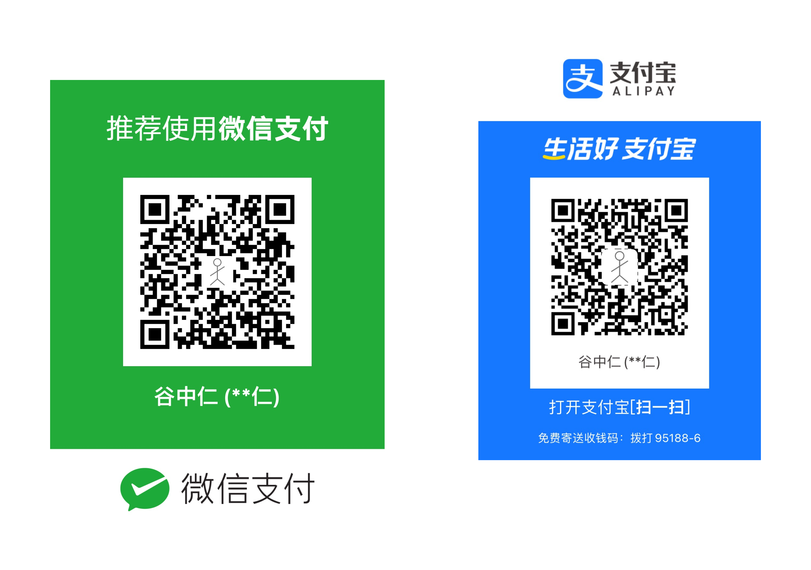

# Deno Restful API With PostgreSql & TDD

## init DB

### Start DB

```shell
make db
```

### Connect DB in pgadmin

Open browser [http://localhost:9099](http://localhost:9099), username/password is admin@admin.com/000000

|Host|UserName|Password|DB|
|--|--|--|--|
|host.docker.internal|postgres|0|postgres|

## 1.Run

 Run up backend with below command

```shell
$ make dev
...
```

## 2.VSCode Debug

Press `F5` key;

## 3.Bundle & Run

```shell
make bundle
```

## 4.更新依赖

> Ref: https://nugine.github.io/deno-manual-cn/linking_to_external_code/integrity_checking.html

```shell
make updateDeps
```

### 5.协作者

```shell
make cache
```

## Ref

* [oak](https://oakserver.github.io/oak/)
* [Creating your first REST API with Deno and Postgres](https://blog.logrocket.com/creating-your-first-rest-api-with-deno-and-postgres/)
* [oak test](https://github.com/oakserver/oak/blob/f293b6f8df1b2fbf27ae0c69424e05fbda887521/context_test.ts#L36)
* [Learn Deno](https://ahmadawais.com/deno/)
* [API Testing and Debugging in Deno](https://www.youtube.com/watch?v=ICWr-j6OF3U)

## 👍


